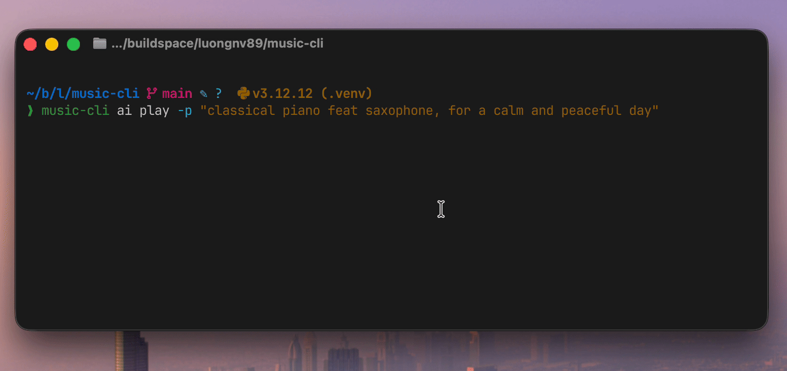

<p align="center">
  
</p>

<p align="center">
  <a href="https://pypi.org/project/coder-music-cli/"></a>
  <a href="https://pepy.tech/project/coder-music-cli"></a>
  <a href="https://github.com/luongnv89/music-cli/stargazers"></a>
  <a href="https://github.com/luongnv89/music-cli/network/members"></a>
  <a href="https://www.python.org/downloads/"></a>
  <a href="https://opensource.org/licenses/MIT"></a>
</p>

<h1 align="center">Your Coding Soundtrack, Without Leaving the Terminal</h1>

<p align="center">
  <strong>mc</strong> (music-cli) is a background music daemon for developers. Radio streams, local MP3s, YouTube audio, and AI-generated music — all from one command. Stay in flow, skip the browser tab.
</p>

<p align="center">
  <a href="#get-started-in-30-seconds"><strong>Get Started in 30 Seconds →</strong></a>
</p>

<p align="center">
  
</p>

---

## Sound Familiar?

- You open Spotify or YouTube to play focus music. Twenty minutes later you're watching a video essay about fonts. Your flow state is gone.
- You want background music while coding, but you don't want *another* app eating RAM and competing for your audio output.
- You finally find the right playlist... and it ends. Or an ad plays. Or the stream dies. Now you're debugging your music instead of your code.

Developers deserve a music player that respects the way they work: in the terminal, in the background, uninterrupted.

## How mc Fixes This

- **Zero context-switching.** Start, pause, and skip tracks without leaving your terminal. Four keystrokes, not four clicks.
- **Always playing.** A persistent background daemon means your music survives terminal closes, SSH sessions, and IDE restarts.
- **40+ curated radio stations.** Lo-fi, synthwave, deep house, jazz — ready out of the box. No account required.
- **AI-generated music.** Generate unique focus tracks with MusicGen, AudioLDM, or Bark. Your music, your mood, no subscription.
- **YouTube audio streaming.** Paste a URL, get audio. Tracks are cached automatically for offline replay.

```bash
mc play -M focus    # Start focus music
mc pause            # Pause for a meeting
mc resume           # Back to coding
mc status           # What's playing + an inspirational quote
```

## How It Works

1. **Install** — one command, no config files to write.
   ```bash
   curl -sSL https://raw.githubusercontent.com/luongnv89/music-cli/main/install.sh | bash
   ```
2. **Play** — pick a mode: radio, local files, YouTube, or AI.
   ```bash
   mc play -M focus
   ```
3. **Forget about it** — the daemon runs in the background. Control it whenever you need.
   ```bash
   mc pause    # meeting time
   mc resume   # back to work
   ```
4. **Explore** — discover 40+ stations, generate AI tracks, or stream from YouTube.
   ```bash
   mc radio                        # Browse stations
   mc ai play -p "jazz piano"     # Generate a track
   mc yt play URL                  # Stream YouTube audio
   ```

<p align="center">
  <a href="#get-started-in-30-seconds"><strong>Start Playing Now →</strong></a>
</p>

## What You Get

| Feature | Details |
|---------|---------|
| **Background daemon** | Music survives terminal closes and IDE restarts |
| **40+ radio stations** | Lo-fi, synthwave, deep house, jazz, French, Spanish, Italian stations — no account needed |
| **AI music generation** | MusicGen, AudioLDM, Bark — generate unique tracks from text prompts |
| **YouTube audio** | Paste a URL, stream audio. Automatic offline caching (2GB LRU) |
| **Context-aware** | Auto-selects music based on time of day and your mood |
| **Local MP3 playback** | Shuffle your own library with `--auto` |
| **Inspirational quotes** | Every `status` check comes with a random music quote |
| **Cross-platform** | Linux, macOS, Windows 10+ |

## Get Started in 30 Seconds

### Quick Install (recommended)

```bash
curl -sSL https://raw.githubusercontent.com/luongnv89/music-cli/main/install.sh | bash
```

Or with wget:

```bash
wget -qO- https://raw.githubusercontent.com/luongnv89/music-cli/main/install.sh | bash
```

### Install from PyPI

```bash
pip install coder-music-cli

# FFmpeg is required
brew install ffmpeg       # macOS
sudo apt install ffmpeg   # Ubuntu/Debian
choco install ffmpeg      # Windows
```

### Optional Extras

```bash
# YouTube streaming support (~10MB)
pip install 'coder-music-cli[youtube]'

# AI music generation (~5GB — PyTorch + Transformers + Diffusers)
pip install 'coder-music-cli[ai]'

# MiniMax Music 3 (~24GB VRAM; CUDA/bfloat16 required)
pip install 'coder-music-cli[minimax]'

# Both
pip install 'coder-music-cli[youtube,ai]'
```

Prefer to inspect the install script first?

```bash
curl -sSL https://raw.githubusercontent.com/luongnv89/music-cli/main/install.sh -o install.sh
less install.sh   # review
bash install.sh
```

## FAQ

**Is it free?**
Yes, 100%. music-cli is MIT licensed, open source, and always will be. No accounts, no subscriptions, no ads.

**Does it work on my OS?**
Linux, macOS, and Windows 10+ are all supported. You need Python 3.10+ and FFmpeg.

**How much disk space does AI music need?**
The base install is tiny. The `[ai]` extra downloads ~5GB (PyTorch + HuggingFace models). Models download on first use, not at install time.

**How does it compare to Spotify/YouTube Music?**
music-cli is not a replacement for your music library. It's a lightweight, terminal-native player for background music while coding. No browser tabs, no electron apps, no accounts.

**Is it actively maintained?**
Yes. The latest release is v0.10.1. Check the [changelog](CHANGELOG.md) for recent updates.

**Can I add my own radio stations?**
Absolutely. Run `mc radio add` or edit `~/.config/music-cli/radios.txt` directly. Format: `Station Name|stream-url`.

**What AI models are supported?**
MusicGen (small/medium/large/melody), AudioLDM (small/large), Bark (standard/small), and the optional lyrics-conditioned MiniMax Music 3 model. See the [AI Playbook](docs/AI_PLAYBOOK.md) for examples and tips.

## Start Coding with Music

You're one command away from a focus soundtrack that never interrupts you. No signups, no ads, no browser tabs. MIT licensed, open source, and built for developers who live in the terminal.

```bash
curl -sSL https://raw.githubusercontent.com/luongnv89/music-cli/main/install.sh | bash && mc play -M focus
```

[**Install music-cli →**](#get-started-in-30-seconds)

---

## Documentation

| Document | Description |
|----------|-------------|
| [User Guide](docs/user-guide.md) | Complete usage instructions |
| [AI Playbook](docs/AI_PLAYBOOK.md) | AI music generation guide with examples |
| [Architecture](docs/architecture.md) | System design and diagrams |
| [Development](docs/development.md) | Contributing guide |
| [Changelog](CHANGELOG.md) | Version history and release notes |

<details>
<summary><strong>Command Reference</strong></summary>

```
mc                          # show status
mc play [SOURCE]            # smart play (auto-detects file/URL/station)
mc play -M focus            # mood-based radio
mc stop / mc s              # stop
mc pause / mc pp            # pause
mc resume / mc r            # resume
mc next / mc n              # next track
mc vol [0-100]              # get/set volume
mc status / mc st           # full status

mc radio                    # list stations
mc radio play N             # play station #N
mc radio add                # add station
mc radio remove N           # remove station
mc radio update             # update station list

mc yt play URL              # stream YouTube audio
mc yt / mc yt list          # list cached tracks
mc yt play N                # replay cached track
mc yt remove N / clear      # manage cache

mc ai play [-p PROMPT]      # generate AI music
mc ai play --lyrics LYRICS  # lyrics-conditioned models such as MiniMax Music 3
mc ai / mc ai list          # list generated tracks
mc ai replay N              # replay generated track
mc ai model                 # list/download/delete/default models

mc history / mc h            # show play history
mc history play N            # replay from history
mc mood [MOOD]              # list moods or play mood radio

mc config                   # show config paths
mc daemon start|stop|status # manage daemon
```

> **Note:** `music-cli` still works as the full command name for all commands.

Use `-h` or `--help` at any level for details (e.g. `mc -h`, `mc play -h`, `mc radio -h`).

</details>

<details>
<summary><strong>Migration Guide (from music-cli v1)</strong></summary>

| Old command | New command |
|---|---|
| `music-cli play -m local -s file.mp3` | `mc play file.mp3` |
| `music-cli play -m youtube -s URL` | `mc yt play URL` |
| `music-cli play -m history -i 3` | `mc history play 3` |
| `music-cli play -m ai` | `mc ai play` |
| `music-cli radios` | `mc radio` |
| `music-cli update-radios` | `mc radio update` |
| `music-cli volume 50` | `mc vol 50` |

All old command names continue to work as hidden aliases; they are simply no longer shown in `--help`.

</details>

<details>
<summary><strong>Play Modes</strong></summary>

```bash
# Smart play (auto-detects source)
mc play                              # Context-aware radio
mc play ~/song.mp3                   # Local file
mc play "https://youtube.com/..."    # YouTube URL
mc play "deep house"                 # Station name

# Mood-based
mc play -M focus                     # By mood

# Local shuffle
mc play -m local --auto              # Shuffle local files

# AI (requires [ai] extras)
mc ai play -p "happy jazz" -d 60    # Generate a 60s track

# YouTube
mc yt play URL                       # Stream YouTube audio

# History
mc history play 3                    # Replay item #3
```

</details>

<details>
<summary><strong>Radio Station Management</strong></summary>

```bash
# List all stations with numbers
mc radio
mc radio list

# Play by station number
mc radio play 5

# Add a new station interactively
mc radio add

# Remove a station
mc radio remove 10
```

### Pre-configured Stations

40 stations across multiple genres and languages:

- **Chill/Lo-fi**: ChillHop, SomaFM (Groove Salad, Drone Zone, Space Station)
- **Electronic**: Deep House, DEF CON Radio, Beat Blender
- **Synthwave**: Nightride FM, Chillsynth FM, Darksynth FM, Datawave FM, Spacesynth FM
- **French**: FIP Radio, France Inter, France Musique, Mouv
- **Spanish**: Salsa Radio, Tropical 100, Los 40 Principales, Cadena SER
- **Italian**: Radio Italia, RTL 102.5, Radio 105, Virgin Radio Italy

</details>

<details>
<summary><strong>AI Music Generation</strong></summary>

Generate unique audio with multiple AI models via HuggingFace:

```bash
# Install AI dependencies (~5GB: PyTorch + Transformers + Diffusers)
pip install 'coder-music-cli[ai]'

# Generate and manage AI music
mc ai play                              # Context-aware (default: musicgen-small)
mc ai play -p "jazz piano"              # Custom prompt
mc ai play -m audioldm-s-full-v2        # Use AudioLDM model
mc ai play -m bark-small -p "Hello!"    # Use Bark for speech
mc ai play -M focus -d 30              # 30-second focus track
mc ai model                             # List available models
mc ai list                              # List all generated tracks
mc ai replay 1                          # Replay track #1
mc ai remove 2                          # Delete track #2
```

### Available AI Models

| Model ID | Type | Best For | Size |
|----------|------|----------|------|
| `musicgen-small` | MusicGen | Music generation (default) | ~1.5GB |
| `musicgen-medium` | MusicGen | Higher quality music | ~3GB |
| `musicgen-large` | MusicGen | Best quality music | ~6GB |
| `musicgen-melody` | MusicGen | Melody-conditioned music | ~3GB |
| `audioldm-s-full-v2` | AudioLDM | Sound effects, ambient audio | ~1GB |
| `audioldm-l-full` | AudioLDM | High-quality audio generation | ~2GB |
| `bark` | Bark | Speech synthesis, audio with voice | ~5GB |
| `bark-small` | Bark | Faster speech synthesis | ~1.5GB |
| `minimax-music3` | MiniMax Music 3 | Lyrics-conditioned songs | ~24GB |

### AI Command Suite

| Command | Description |
|---------|-------------|
| `mc ai model` | List all available AI models |
| `mc ai list` | Show all AI-generated tracks with prompts |
| `mc ai play` | Generate music from current context |
| `mc ai play -m <model>` | Generate with specific model |
| `mc ai play -p "prompt"` | Generate with custom prompt |
| `mc ai play -M focus` | Generate with specific mood |
| `mc ai play -d 30` | Generate 30-second track (default: 15s) |
| `mc ai replay <num>` | Replay track by number (regenerates if file missing) |
| `mc ai remove <num>` | Delete track and audio file |

### AI Features
- **Multiple models** — MusicGen, AudioLDM, Bark, and optional MiniMax Music 3
- **Smart caching** — LRU cache keeps up to 2 models in memory (configurable)
- **Download progress** — Progress bar shown during model downloads
- **GPU memory management** — Automatic cleanup when switching models
- **Context-aware** — Uses time of day, day of week, and session mood
- **Custom prompts** — Generate exactly what you want with `-p`
- **Seamless looping** — All tracks engineered for infinite playback
- **Track management** — List, replay, and remove generated tracks
- **Regeneration** — Missing files can be regenerated with original prompt

### AI Requirements
- ~5GB disk space minimum (PyTorch + Transformers + Diffusers)
- ~8GB RAM minimum for generation (16GB recommended for larger models)
- MiniMax Music 3 uses `pip install 'coder-music-cli[minimax]'`, requires CUDA, bfloat16, and approximately 24GB VRAM
- Models are downloaded on first use

### AI Configuration

Configure in `~/.config/music-cli/config.toml`:

```toml
[ai]
default_model = "musicgen-small"  # Default model for generation

[ai.cache]
max_models = 2  # Max models to keep in memory (LRU eviction)

[ai.models.audioldm-s-full-v2.extra_params]
num_inference_steps = 10  # More = better quality, slower
guidance_scale = 2.5      # How closely to follow prompt
```

</details>

<details>
<summary><strong>YouTube Audio Streaming & Cache</strong></summary>

Stream audio directly from YouTube URLs with automatic offline caching:

```bash
# Play YouTube audio (automatically cached)
mc play "https://youtube.com/watch?v=..."
mc play "https://youtu.be/..."

# Manage cached tracks
mc yt                    # List all cached tracks
mc yt list               # Same as above
mc yt play 3             # Play cached track #3 (works offline)
mc yt remove 1           # Remove cached track #1
mc yt clear              # Clear entire cache
```

### YouTube Command Suite

| Command | Description |
|---------|-------------|
| `mc yt` | List all cached tracks (default) |
| `mc yt list` | List cached tracks with cache statistics |
| `mc yt play <num>` | Play cached track by number (offline) |
| `mc yt remove <num>` | Remove a cached track |
| `mc yt clear` | Clear all cached tracks |

### YouTube Features
- **Automatic caching** — Audio cached in background while streaming
- **Offline playback** — Play cached tracks without internet
- **LRU eviction** — 2GB cache limit with automatic cleanup of oldest tracks
- **M4A format** — 192kbps quality for good balance of size and quality
- **Instant replay** — Cached tracks play immediately

### YouTube Configuration

Configure in `~/.config/music-cli/config.toml`:

```toml
[youtube.cache]
enabled = true          # Enable/disable automatic caching
max_size_gb = 2.0       # Maximum cache size in GB
```

### Cache Location

- **Linux/macOS**: `~/.config/music-cli/youtube_cache/`
- **Windows**: `%LOCALAPPDATA%\music-cli\youtube_cache\`

</details>

<details>
<summary><strong>Moods</strong></summary>

`focus` `happy` `sad` `excited` `relaxed` `energetic` `melancholic` `peaceful`

</details>

<details>
<summary><strong>Configuration</strong></summary>

Configuration files location:
- **Linux/macOS**: `~/.config/music-cli/`
- **Windows**: `%LOCALAPPDATA%\music-cli\`

| File | Purpose |
|------|---------|
| `config.toml` | Settings (volume, mood mappings, version) |
| `radios.txt` | Station URLs (name\|url format) |
| `history.jsonl` | Play history |
| `ai_tracks.json` | AI track metadata (prompts, durations) |
| `ai_music/` | AI-generated audio files |
| `youtube_cache.json` | YouTube cache metadata |
| `youtube_cache/` | Cached YouTube audio files |

### Version Updates

When you update music-cli, you'll be notified if new radio stations are available:

```bash
# Check and update stations
mc radio update

# Options:
# [M] Merge   - Add new stations to your list (recommended)
# [O] Overwrite - Replace with new defaults (backs up old file)
# [K] Keep    - Keep your current stations unchanged
```

### Add Custom Stations

```bash
# Interactive
mc radio add

# Or edit directly: ~/.config/music-cli/radios.txt
ChillHop|https://streams.example.com/chillhop.mp3
Jazz FM|https://streams.example.com/jazz.mp3
```

</details>

<details>
<summary><strong>Status & Quotes</strong></summary>

The `status` command shows playback info plus a random inspirational quote:

```bash
$ mc status
Status: ▶ playing
Track: Groove Salad [radio]
Volume: 80%
Context: morning / weekday

"Music gives a soul to the universe, wings to the mind, flight to the imagination." - Plato

Version: 0.10.1
GitHub: https://github.com/luongnv89/music-cli
```

</details>

---

## Requirements

- Python 3.10+
- FFmpeg
- **Supported Platforms**: Linux, macOS, Windows 10+

## Contributors

Thanks to all contributors who have helped improve music-cli!

| Contributor | PR | Contribution |
|-------------|-----|--------------|
| [kylephillipsau](https://github.com/kylephillipsau) | [#5](https://github.com/luongnv89/music-cli/pull/5) | Improved YouTube livestream playback for radio stations by piping yt-dlp to ffplay for reliable HLS buffering and reconnections |

## Acknowledgements

music-cli is built with these excellent open-source libraries:

| Library | Maintainer | Purpose |
|---------|------------|---------|
| [Click](https://github.com/pallets/click) | [Pallets](https://github.com/pallets) | CLI framework for building commands and argument parsing |
| [tomli](https://github.com/hukkin/tomli) | [hukkin](https://github.com/hukkin) | TOML parser for reading configuration files |
| [tomli-w](https://github.com/hukkin/tomli-w) | [hukkin](https://github.com/hukkin) | TOML writer for saving configuration files |
| [pyobjc](https://github.com/ronaldoussoren/pyobjc) | [Ronald Oussoren](https://github.com/ronaldoussoren) | macOS framework bindings for media key support |
| [dbus-next](https://github.com/altdesktop/python-dbus-next) | [altdesktop](https://github.com/altdesktop) | D-Bus client for Linux MPRIS media controls |
| [PyTorch](https://github.com/pytorch/pytorch) | [PyTorch Team](https://github.com/pytorch) | Deep learning framework powering AI music generation |
| [Transformers](https://github.com/huggingface/transformers) | [Hugging Face](https://github.com/huggingface) | Pre-trained models for MusicGen and Bark |
| [Diffusers](https://github.com/huggingface/diffusers) | [Hugging Face](https://github.com/huggingface) | Diffusion models for AudioLDM audio generation |
| [SciPy](https://github.com/scipy/scipy) | [SciPy Community](https://github.com/scipy) | Scientific computing for audio signal processing |
| [tqdm](https://github.com/tqdm/tqdm) | [tqdm developers](https://github.com/tqdm) | Progress bars for model downloads and generation |
| [yt-dlp](https://github.com/yt-dlp/yt-dlp) | [yt-dlp Team](https://github.com/yt-dlp) | YouTube audio extraction and streaming |

## License

MIT
