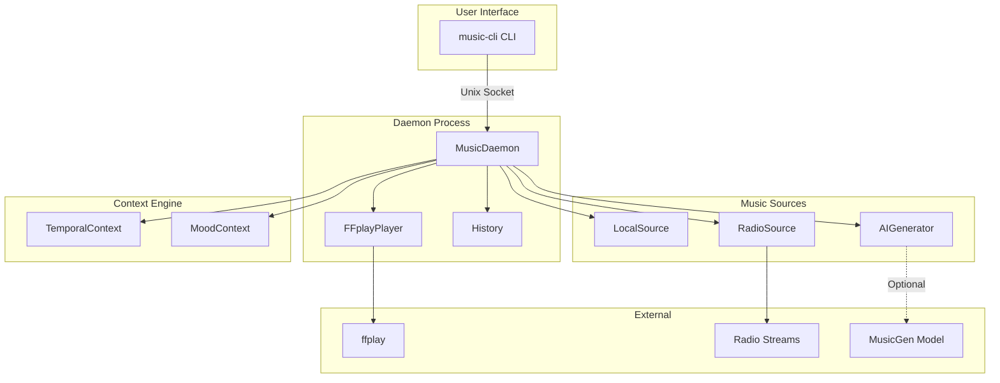
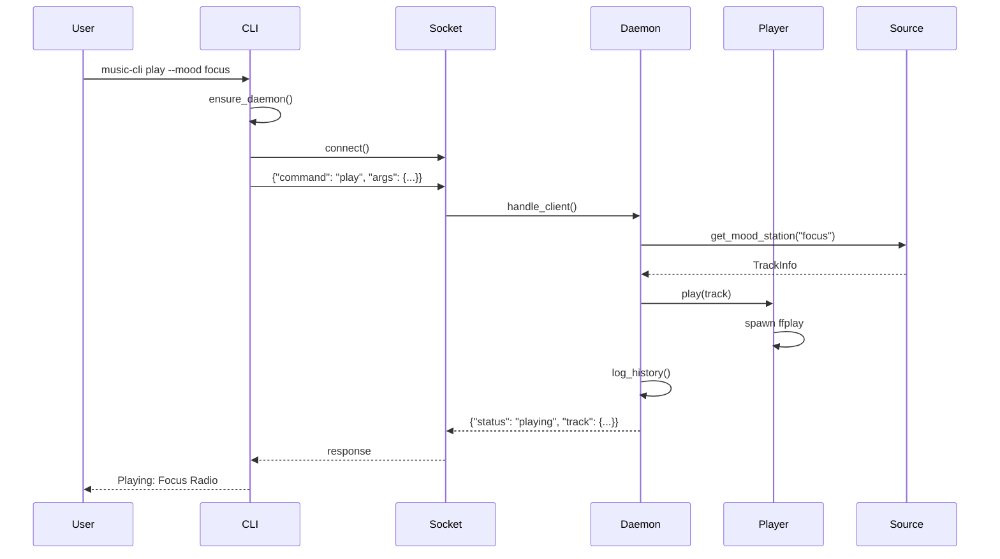
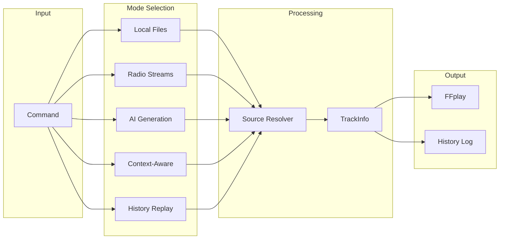
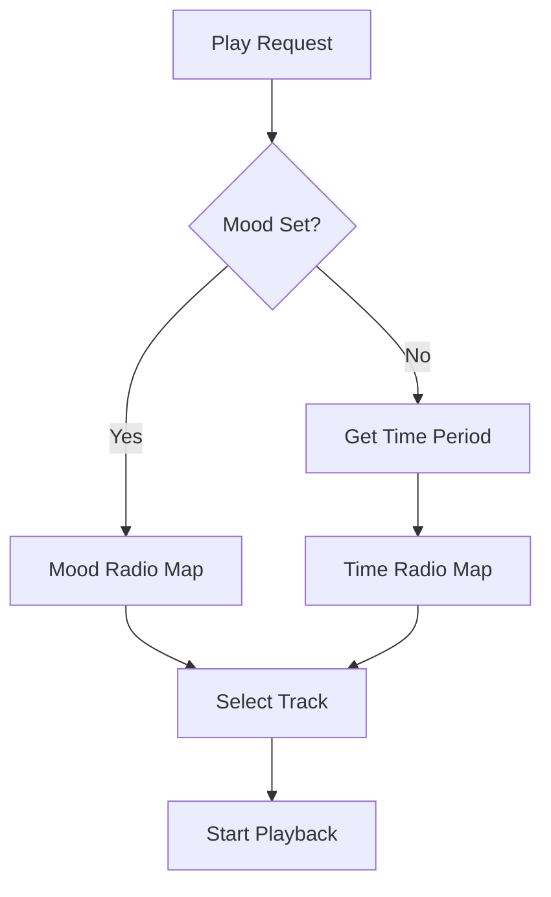

# Architecture

music-cli uses a daemon-based architecture for persistent background playback with CLI control.

## System Overview



## Component Architecture

### Core Components

| Component | Module | Responsibility |
|-----------|--------|----------------|
| CLI | `cli.py` | User commands, daemon lifecycle |
| Client | `client.py` | Socket communication with daemon |
| Daemon | `daemon.py` | Background process, command routing |
| Player | `player/` | Audio playback via ffplay |
| Sources | `sources/` | Music content providers |
| Context | `context/` | Smart music selection |
| History | `history.py` | Playback logging |
| Config | `config.py` | Settings management |

### Daemon Architecture



## Data Flow

### Playback Modes



### Context-Aware Selection



## IPC Protocol

Communication uses JSON over Unix sockets:

### Request Format
```json
{
  "command": "play|stop|pause|resume|status|...",
  "args": {
    "mode": "local|radio|ai|context|history",
    "source": "path/url/name",
    "mood": "focus|happy|sad|...",
    "auto": true
  }
}
```

### Response Format
```json
{
  "status": "playing|paused|stopped",
  "track": {
    "source": "/path/or/url",
    "source_type": "local|radio|ai",
    "title": "Track Name"
  },
  "error": "Error message if failed"
}
```

## File Structure

```
~/.config/music-cli/
├── config.toml      # User settings
├── radios.txt       # Radio station URLs
├── history.jsonl    # Playback history
├── music-cli.sock   # Unix socket (runtime)
└── music-cli.pid    # Daemon PID (runtime)
```

## Dependencies

### Required
- Python 3.9+
- FFmpeg (ffplay)
- click, tomli-w

### Optional (AI Mode)
- PyTorch
- transformers
- audiocraft (MusicGen)

## Design Decisions

| Decision | Rationale |
|----------|-----------|
| Daemon + Socket | Persistent playback, fast command response |
| ffplay backend | Lightweight, supports streaming, widely available |
| JSON-lines history | Human-readable, easy to parse/grep |
| TOML config | Clean syntax, Python 3.11+ native support |
| Optional AI | Graceful degradation, large dependency (~5GB) |
